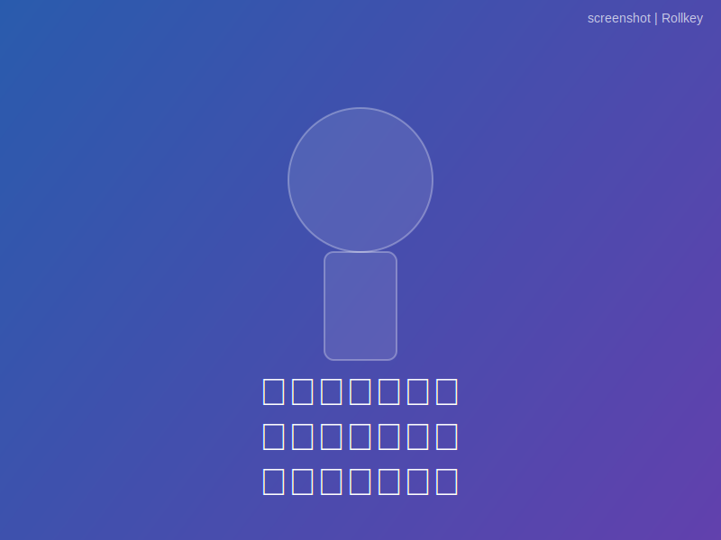

# 字幕截图生成器

一个现代化的字幕截图生成工具，让你轻松为名人演讲和访谈添加自定义字幕，生成具有说服力的截图。



> "都有截图了一定是真的" 😄

## ✨ 特性

- 🎨 **现代化UI** - 采用渐变背景和玻璃态设计
- 📱 **响应式设计** - 完美适配桌面和移动设备
- 🖼️ **多种背景** - 内置名人背景图 + 自定义图片上传
- 🔤 **多语言支持** - 中文、英文、中英双语字幕
- 🎛️ **实时调节** - 字体大小、行高、对齐方式实时预览
- 💧 **水印系统** - 可选择移除水印（需关注公众号）
- ⚡ **即时导出** - 一键导出高清PNG图片
- 🎯 **预设样式** - 多种预设样式快速应用

## 🚀 快速开始

### 安装依赖

```bash
npm install
# 或
yarn install
# 或
pnpm install
```

### 启动开发服务器

```bash
npm run dev
# 或
yarn dev
# 或
pnpm dev
```

在浏览器中访问 `http://localhost:3000`

### 构建生产版本

```bash
npm run build
# 或
yarn build
# 或
pnpm build
```

## 📁 项目结构

```
imghub/
│── public/
│   ├── assets/heroes/     # 名人背景图
│   └── favicon.svg        # 网站图标
│
│── src/
│   ├── components/
│   │   ├── ScreenshotGenerator.jsx  # 主组件
│   │   ├── HeroSelector.jsx         # 英雄选择器
│   │   ├── SubtitleInput.jsx        # 字幕输入
│   │   ├── CanvasPreview.jsx        # 预览区
│   │   ├── Controls.jsx             # 样式控制
│   │   └── WatermarkModal.jsx       # 水印弹窗
│   │
│   ├── layouts/
│   │   └── Layout.astro             # 页面布局
│   │
│   ├── pages/
│   │   └── index.astro              # 主页
│   │
│   ├── styles/
│   │   └── global.css               # 全局样式
│   │
│   └── utils/
│       └── canvasUtils.js           # Canvas工具函数
│
└── package.json
```

## 🎨 技术栈

- **框架**: [Astro](https://astro.build/) - 静态站点生成
- **UI框架**: [React](https://reactjs.org/) - 交互组件
- **样式**: [Tailwind CSS](https://tailwindcss.com/) - 原子化CSS
- **图标**: [Lucide React](https://lucide.dev/) - 现代图标库
- **图片生成**: HTML5 Canvas API

## 📖 使用说明

### 1. 选择背景

- **系统背景**: 从下拉列表中选择内置的名人背景图
- **自定义背景**: 上传本地图片作为背景

### 2. 输入字幕

- 支持多行文本输入
- 选择字幕类型：中文 / 英文 / 中英双语
- 使用快速模板或自定义内容

### 3. 调整样式

- **字体大小**: 20-80px 滑块调节
- **行高**: 1.0-2.5 倍行距
- **对齐方式**: 左对齐 / 居中 / 右对齐
- **垂直位置**: 顶部 / 中间 / 底部
- **预设样式**: 一键应用预定义样式

### 4. 导出图片

- 实时预览效果
- 一键导出高清PNG格式
- 默认带水印，可选择移除

## 🖼️ 添加背景图片

将名人背景图片放置在 `public/assets/heroes/` 文件夹中：

- `jobs.jpg` - 乔布斯
- `musk.jpg` - 马斯克
- `ma.jpg` - 马云
- `luo.jpg` - 罗永浩
- `luxun.jpg` - 鲁迅
- `moyan.jpg` - 莫言
- `guodegang.jpg` - 郭德纲
- `liuneng.jpg` - 刘能

### 图片要求

- 格式：JPG 或 PNG
- 尺寸：建议 800x600 或 4:3 比例
- 大小：不超过 2MB
- 质量：高清，人物清晰可见

## 🎯 核心功能

### Canvas 图片生成

使用 HTML5 Canvas API 实现：
- 背景图片绘制和缩放
- 多行文字渲染
- 文字描边和阴影效果
- 水印添加
- 高质量图片导出

### 响应式设计

- 移动设备优化
- 触摸友好的控件
- 自适应布局

### 性能优化

- 图片懒加载
- Canvas 重绘优化
- 节流函数防抖
- 内存管理

## 🔧 自定义配置

### 修改默认样式

编辑 `src/components/ScreenshotGenerator.jsx` 中的默认值：

```javascript
const [fontSize, setFontSize] = useState(42);
const [lineHeight, setLineHeight] = useState(1.5);
const [textAlign, setTextAlign] = useState('left');
```

### 添加新的名人

1. 在 `public/assets/heroes/` 中添加图片
2. 在 `src/components/HeroSelector.jsx` 中添加配置：

```javascript
const heroes = [
  // ... 现有配置
  { id: 'newHero', name: '新名人', image: '/assets/heroes/newHero.jpg' },
];
```

### 自定义水印

修改 `src/components/CanvasPreview.jsx` 中的水印文字：

```javascript
const watermarkText = 'imghub | Rollkey';
```

## 📱 移动端适配

- 触摸优化的滑块控件
- 响应式网格布局
- 移动端字体大小调整
- 触摸友好的按钮尺寸

## 🎨 主题定制

编辑 `tailwind.config.mjs` 自定义颜色主题：

```javascript
theme: {
  extend: {
    colors: {
      primary: {
        // 自定义主色调
      },
    },
  },
}
```

## 📄 许可证

MIT License

## 🤝 贡献

欢迎提交 Pull Request 和 Issue！

1. Fork 项目
2. 创建特性分支
3. 提交更改
4. 推送到分支
5. 创建 Pull Request

## 📞 联系方式

如有问题或建议，请通过以下方式联系：

- 创建 [Issue](../../issues)
- 发送邮件至开发者

---

**"都有截图了一定是真的"** 😄
